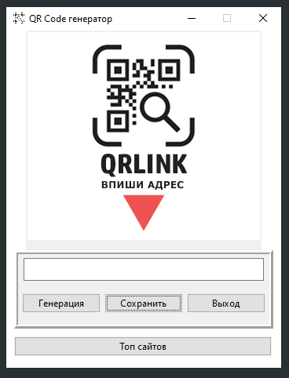
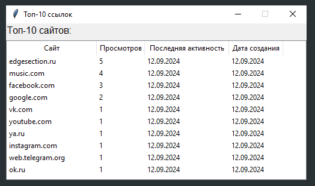

# qrcodes
## Перевод ссылок в QR-код

Данная программа генерирует из текста QR-код, который хранит информацию.

При этом программа заносит факт создания QR-кода в базу данных SQLite для предотвращения занятия нескольких QR-кодов одной ссылок, что позволяют в свою очередь рационально использовать QR-коды.

Факт повторного создания QR-кода тоже заносится в БД, что в свою очередь позволяет составить топ ссылок, которые чаще всего используются.

> [!IMPORTANT]
> Перед запуском программы, выполните команду в консоли: python3 -m pip install qrcode pillow
> 
> Эта команда устанавливает библиотеку QRCode с пакетом pillow на 3 версию Python
>
> После установите SQLite, ведя команду: python3 -m pip install sqlite3-api

- [x] Создание репозитория и проекта
- [ ] Создание презентации
- [ ] Создание кода

> [!NOTE]
> .

> [!TIP]
> .

> [!WARNING]
> .

> [!CAUTION]
> .
